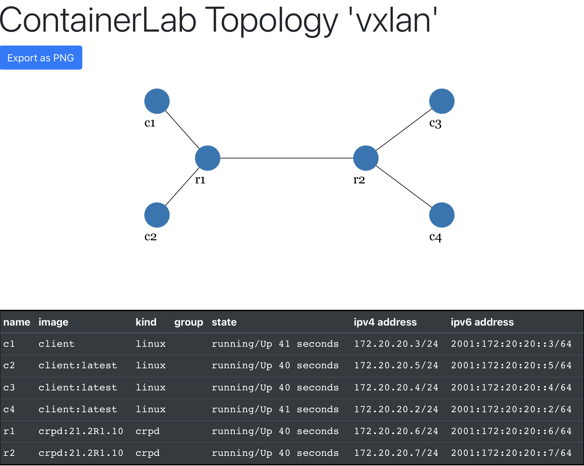

# crpd-evpn-vxlan-type5

## Topology

2 cRPD containers (r1 and r2) are interconnected via two IPv4 links,
running ISIS and BGP. 4 Ubuntu containers (c1..c4) are connected to
two separate EVPN VXLAN Type-5 based overlay networks:

- c1 and c2 are part of the overlay VPN blue (__crpd-vrf1)
- c3 and c4 belong to the overlay VPN yellow (__crpd-vrf2)

```
+----+   +------+        +------+   +----+
| c1 |---|      |--------|      |---| c2 |
+----+   |  r1  |  BGP   |  r2  |   +----+
+----+   |      |  ISIS  |      |   +----+
| c3 |---|      |--------|      |---| c4 |
+----+   +------+        +------+   +----+
```

## Requirements

- Juniper cRPD container image version 21.2R1 or newer
- License key, eval key works: https://www.juniper.net/us/en/dm/crpd-free-trial.html
- Ubuntu host (tested with 20.04, 18.04 should work too, other distributions might work)
- Docker and docker-compose and make installed
- Internet connection (to download and build the ubuntu based client containers)
- Containerlab (https://containerlab.srlinux.dev) as an alternative deployment method

## Deploy via docker-compose

Place the cRPD license key into the file junos_sfnt.lic in the top folder (where the docker-compose.yml
and this README.md files are). Alternatively, add your license key directly into the cRPD config file
found in r1/juniper.conf and r2/juniper.conf. 

Simply run 'make' will do the trick. Check [Makefile](Makefile) if you prefer to execute
the steps manually. First, docker-compose is used to bring up the topology, then the license key
is added to the running crpd instances unless already present (the keys persist re-deployments).
Finally, the [validate.sh](validate.sh) script is executed, checking everything from isis adjacency,
BGP neighbors, evpn routes in cRPD and the linux network namespace of the cRPD containers, followed
by a connectivity test between c1 and c2 and c3 and c4, while capturing the traffic over the veth link
between r1 and r2 in a pcap file and dump its content. Finally, a quick iperf3 test is run between c1 and
c2 and the results shown.

You can find a successful output of a deployment in [validate.log.txt](validate.log.txt) for reference.

## Deploy via containerlab

The yaml file [vxlan-type5-crpd.clab.yml](vxlan-type5-crpd.clab.yml) contains instructions to deploy
the lab in containerlab, which offers many more functionalities, like multi-vendor, multi-node deployments and network
diagrams. Check out https://containerlab.srlinux.dev for details about containerlab.

To deploy the topology, either use 'make deploy' or directly the command

```
$ sudo containerlab deploy --topo vxlan-type5-crpd.clab.yml
```

Then launch the validation script, adjusted for containerlab, to check the vxlan tunnels are working:

```
$ ./clab-validation.sh
```

To get a graphical network diagram, launch containerlabs graph via 'make graph', then connect to localhost:50080 via
browser:




## Terminate

Run 'make down' or 'docker-compose down' will stop the running containers.
If deployed via containerlab, use 'make destroy' or 'sudo containerlabs destroy --topo vxlan-type5-crpd.clab.yml'.

## References


- [Blog post crpd-evpn-vxlan-type5 by Marcel Wiget](https://marcelwiget.blog/2021/07/01/crpd-evpn-vxlan-type-5/)
- [Day One eBook: Data Center Deployment with EVPN/VXLAN by Deepti Chandra](https://www.juniper.net/documentation/en_US/day-one-books/TW_DCDeployment.v2.pdf)
- [Juniper cRPD technical documentation](https://www.juniper.net/documentation/product/us/en/crpd)
- [https://github.com/mwiget/link-containers](https://github.com/mwiget/link-containers)
- [https://github.com/srl-labs/containerlab](https://github.com/srl-labs/containerlab)
